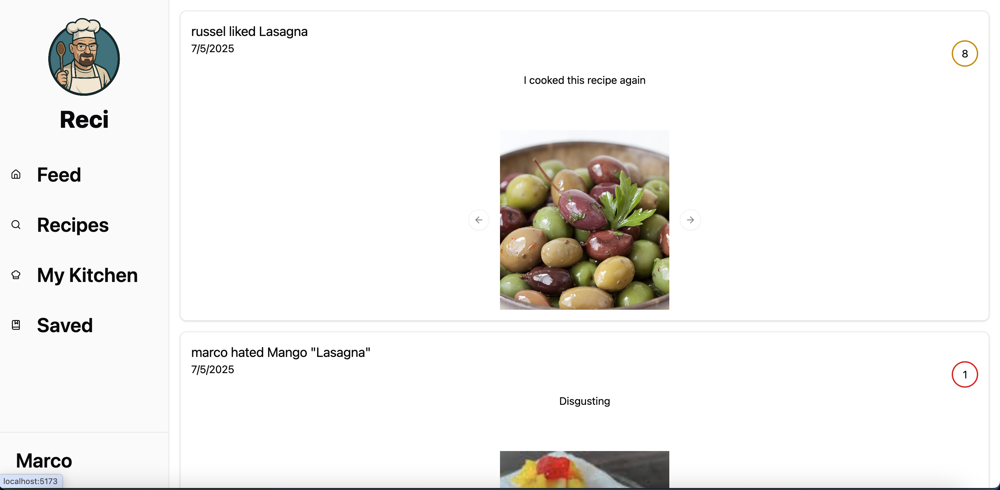
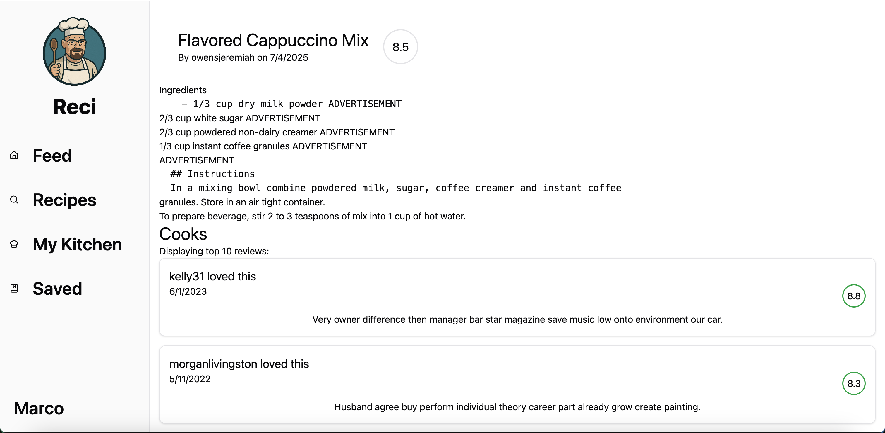

# Reci - It's time to cook!

Reci is a social recipe-sharing app where users can post recipes, review what they’ve cooked, and follow friends to stay updated on what’s hot in their kitchens.

## App structure

This repo is strucutred as a mono-repo, with our frontend living under `frontend/`, and our backend living in `backend/`. The frontend is built using React, while the backend is built with Express. Both can be started with `npm run dev`, but see the startup instructions for more details. This is where the end-to-end application code that implements all the claimed features is.

### SQL queries for features

Of special note, the backend pulls the SQL instructions it needs at runtime from the `backend/sql/` folder. This folder is where all SQL lives for our project, including our seeding code.

Instead of having a single `test-sample.sql`, for each of our features listed in the Milestone 1 report, you can find their query in the `backend/sql/` folder, and their corresponding expected output in `backend/sql/test-sample-out/` such as `backend/sql/test-sample-out/filterRecipes.out`.

We do not have `test-production` outputs yet.

## How to create and load the database

Every time the app starts up, we automatically delete the existing database instance (by doing `docker compose down -v` which deletes it's volume), create a new database container (by doing `docker compose up`), automatically run `backend/sql/init.sql` to create tables, constraints, stored procedures, and triggers, and finally run `backend/sql/seed.sql` to seed the database with toy data.

This process is made to ensure a consistent developer environement, making it fast to iterate on our SQL schemas.

### Generating production data

Our production data generation script also lives in `backend/sql/seed/`, and you can read more about it in the README located there. This is the code for downloading/scraping/transforming real data that we have written.

For instructions to generate our production data, read `backend/sql/seed/README.md`. We consider production data as a dataset with 100k - 1 million total entries.

## How to run the app

This is how to run our working database-driven application.

### Installation

1. Installed [docker](https://www.docker.com/get-started/)
2. Install npm
3. From the root of the repo, run `npm install`
4. Create a `.env` by copying the contents of `example.env`

As a note: the JWT secret is generated with `openssl rand -base64 32`, but we use the same secret in dev for consistency.

### Startup

1. Make sure docker is running
2. Run `npm run dev`. It will start the docker container for the database, npm install in FE and BE, startup the dev apps, and automatically reset and seed the database for you!

### Troubleshooting

#### Postgres "authentication failed"

If you run `npm run dev` and notice you get an error containing `error: password authentication failed for user "postgres"`, then there is likely an issue with the port you are using.

To solve the problem, navigate to `docker-compose.yml` and change the line containing the two ports `"5433:5432"` to something else, ex: `"5432:5432"`. You will then need to change the port in the `backend\src\db.ts` to whatever new port you decided to use, ex: `port: 5432`.

Then, go through the setup steps again and it should work!

## Currently supported features

We've worked extensively on our backend systems with a long suite of fleshed out SQL queries and endpoints. Current features include:

- Fully working SQL database with dynamic loading of files
- Signing up and into accounts, and authentication with JWT cookies
- CRUD (Create Read Update Delete) operations for recipies, accounts
- Searching for recipies
- Reading recipies
- Reading followers, following, account information

### NEW (as of Milestone 2)

- Frontend views for the feed, recipe search, settings, profile pages, and recipe views to read the recipes
- Reading recipe reviews, with support for adding images
- Settings page, login 
- Fancy: a dynamic and personalized landing page feed with signed in and annonymous views
- Fancy: using triggers to automatically save recipes that you review
- Fancy: database level following constraints (you can't follow yourself, or follow the same person multiple times)

